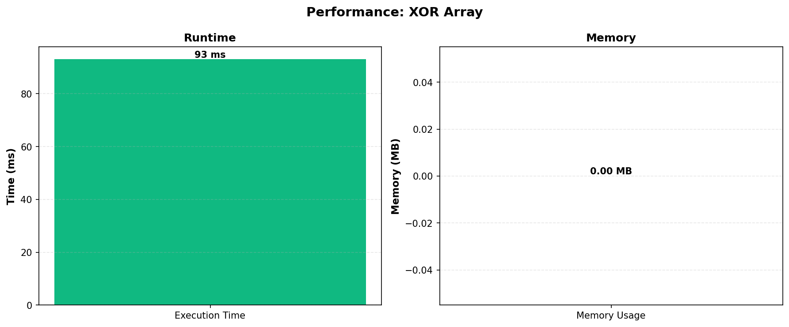

# XOR Array

**Contest ID:** 2175

**Index:** B

**Rating:** 1300

**Problem Link:** [Codeforces](https://codeforces.com/problemset/problem/2175/B)

**Verdict:** OK

**Tags:** `constructive algorithms`, `math`

## Performance

## Performance Metrics

| Metric | Value |
|--------|-------|
| Language | C++23 (GCC 14-64, msys2) |
| Execution Time | 93 ms |
| Memory Used | 0.00 MB |
| Submission Time | 2025-12-09 15:31:07 |

