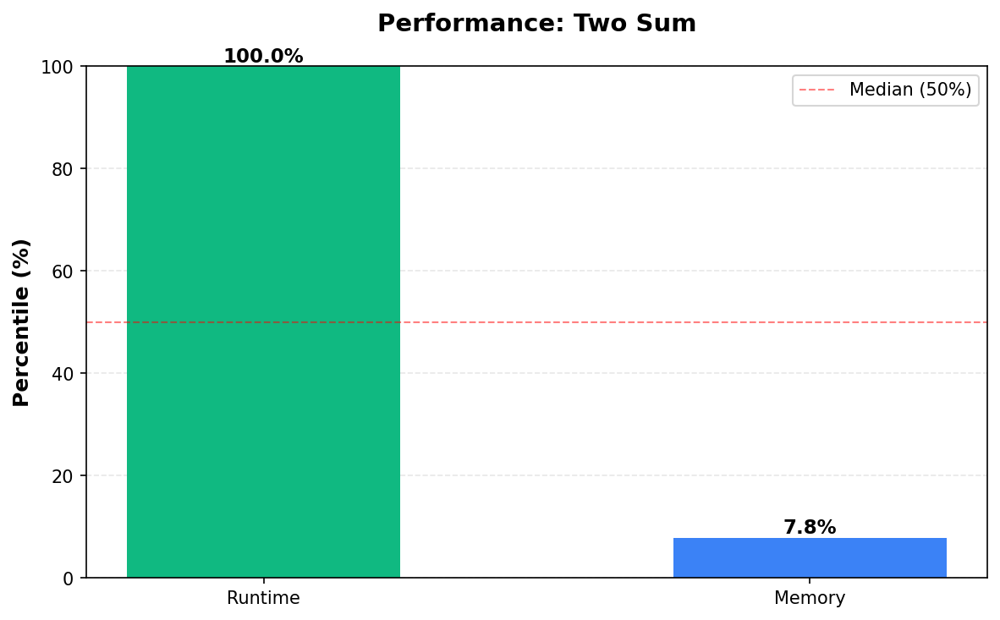

# Two Sum

**Difficulty:** Easy

**Problem Link:** [LeetCode](https://leetcode.com/problems/two-sum/)

**Status:** Accepted

## Performance

## Performance Metrics

| Language | Runtime Percentile | Memory Percentile |
|----------|-------------------|------------------|
| Cpp | 100.00% | 7.84% |
| Python3 | 100.00% | 45.27% |
| Javascript | 53.25% | 35.48% |

